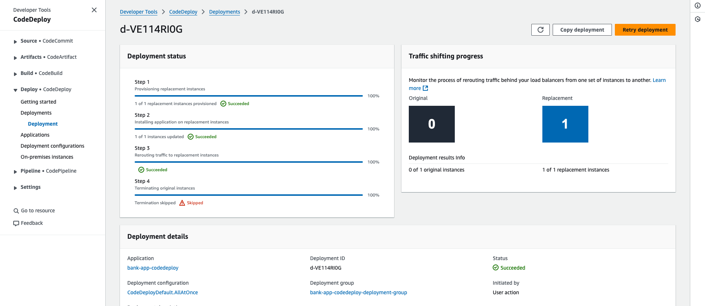
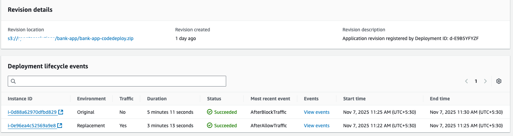
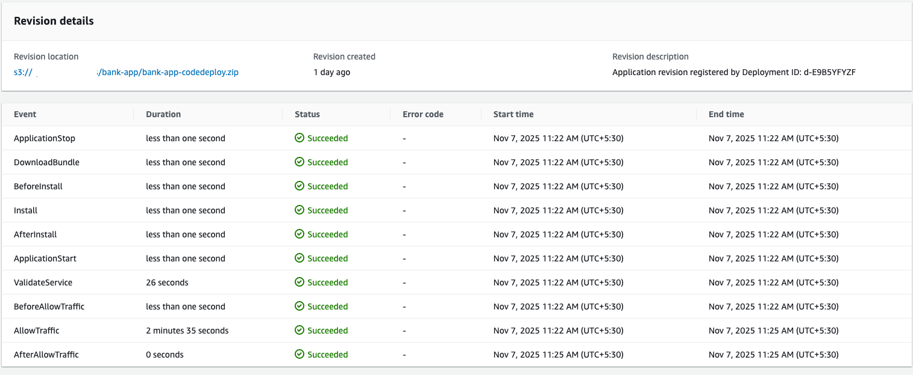
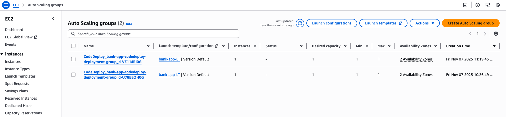
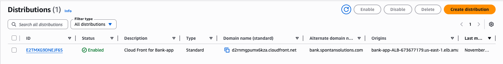
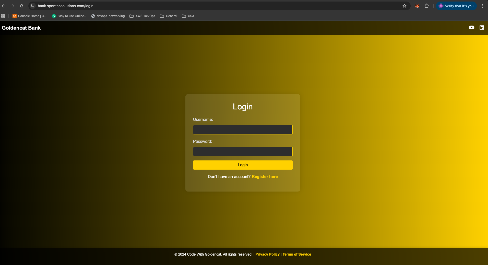

# 🏦 Secure Banking Application on AWS — DevSecOps CI/CD & Cloud Architecture

## 📘 Project Overview
This project demonstrates a **secure, scalable, and production-ready 3-tier architecture** for a **Java Spring Boot Banking Application**, fully deployed on **AWS** using a **DevSecOps CI/CD pipeline** with **GitHub Actions**, **AWS CodeDeploy**, and a **Blue-Green Deployment** strategy.

The design follows AWS best practices for **network isolation**, **data encryption**, and **automated deployments** — providing a true enterprise-grade setup.

---

## 🏗️ AWS Architecture Overview

### 🔹 Key Components

| Tier | AWS Service | Description |
|------|--------------|-------------|
| **Presentation Layer** | **Amazon CloudFront** | CDN for global content delivery and DDoS protection |
|  | **Application Load Balancer (ALB)** | Internet-facing load balancer with HTTPS (SSL termination using ACM) |
|  | **Route 53** | Route 53 provides DNS resolution |
| **Application Layer** | **EC2 Auto Scaling Group (ASG)** | Hosts the Java Spring Boot app in private subnets for scalability and high availability |
|  | **AWS CodeDeploy (Blue-Green)** | Automates deployments and ensures zero downtime |
| **Data Layer** | **Amazon RDS (MySQL)** | Encrypted relational database instance in private subnet |

---

## 🔒 Network & Security Design

### 🕸️ **VPC Configuration**
- **Public Subnets**: Contain the ALB and NAT Gateway  
- **Private Subnets**: Contain EC2 instances, RDS, and VPC Endpoints  
- **Routing**:
  - Private subnets route through **NAT Gateway** to access AWS APIs
  - **VPC Endpoints** ensure private connectivity to S3 and Secrets Manager
 
### 🔑 **VPC Endpoints**
| Endpoint Type | Service | Purpose |
|----------------|----------|----------|
| **Gateway Endpoint** | Amazon S3 | Allows EC2 instances in private subnets to securely download build artifacts (JARs) |
| **Interface Endpoint** | AWS Secrets Manager | Enables secure access to secrets without exposing traffic to the internet |

### 🔐 **Security Groups**
| Resource | Allowed Ports | Source | Purpose |
|-----------|----------------|--------|----------|
| **ALB SG** | 80, 443 | 0.0.0.0/0 | Public web access |
| **EC2 App SG** | 5050 | ALB SG | Application traffic from ALB |
|  | 22 | Bastion/Private subnet only | Restricted SSH access |
| **RDS SG** | 3306 | EC2 App SG | DB connections only from application instances |

All security groups follow the **principle of least privilege** and ensure tight network isolation.

---

### **Route 53 DNS Management**
To enable clean domain-based access and internal resolution:
- **Public Hosted Zone:**
  - Record: `bank.spontansolutions.com`
  - Target: **CloudFront Distribution DNS**
  - Purpose: Public users access the application via HTTPS endpoint `https://bank.spontansolutions.com`
- **Private Hosted Zone:**
  - Record: `bank-db.spontansolutions.com`
  - Target: **RDS MySQL Endpoint**
  - Purpose: Private DNS resolution for EC2 application servers to securely access the RDS database within the VPC.

---

## 🧱 Data Encryption & Security

### 🛡️ **At-Rest Encryption**
| Resource | KMS Key | Description |
|-----------|----------|-------------|
| **EC2 EBS Volumes** | `aws/ebs` | Automatically encrypted using AWS-managed KMS key. Data written to or read from the disk is transparently encrypted/decrypted by AWS. |
| **RDS MySQL** | `aws/rds` | All database storage, backups, and snapshots are encrypted using AWS-managed KMS key. Decryption is automatic during read operations. |

> Both services (EBS and RDS) use **AWS-managed keys**, providing strong encryption without requiring custom KMS permissions or key management overhead.

### 🧩 **In-Transit Encryption**
- SSL/TLS enabled for:
  - **Application Load Balancer (HTTPS on port 443)**  
  - **CloudFront to ALB communication (HTTPS)**

### 🔐 **Secrets Management**
- Application secrets (DB credentials, tokens) are stored securely in **AWS Secrets Manager**.
- EC2 instances access secrets privately through the **VPC Interface Endpoint**.

---

## 💻 Application Overview
A **Java Spring Boot Banking Application** that provides essential banking operations with secure user authentication and persistent storage.

### 🧠 Core Features
- 👤 User Registration & Login
- 💰 Deposit & Withdraw Funds
- 🔁 Transfer Between Accounts
- 📜 View Transaction History
- 🧾 Database persistence with RDS MySQL

All sensitive data and transactions are encrypted and handled securely.

---

## ⚙️ DevSecOps CI/CD Pipeline

### 🚀 **Pipeline Stages (GitHub Actions)**

| Phase | Tool | Description |
|--------|------|-------------|
| **Pre-Build** | Trivy | Vulnerability and security scan of source code |
|  | SonarQube | Static code analysis & quality gates |
| **Build** | Maven | Compile, test, and package JAR artifact |
| **Artifact Storage** | AWS S3 | Stores packaged JAR artifact for deployment |
| **Deployment** | AWS CodeDeploy | Blue-Green deployment to EC2 Auto Scaling Group |
| **Notification** | Slack | Real-time build and deployment status |

> Pipeline defined in `.github/workflows/devsecops.yml`, triggered on code push to `main`.

---

## 🧰 Tech Stack

| Category | Tool |
|-----------|------|
| **Language** | Java 17 |
| **Framework** | Spring Boot |
| **Build Tool** | Maven |
| **CI/CD** | GitHub Actions + AWS CodeDeploy |
| **Security** | Trivy, SonarQube, AWS Secrets Manager |
| **Storage** | AWS S3 |
| **Database** | Amazon RDS (MySQL) — Encrypted with `aws/rds` |
| **Compute** | EC2 (Private Subnet) — Volumes encrypted with `aws/ebs` |
| **Networking** | VPC, NAT Gateway, VPC Endpoints |
| **Load Balancing** | AWS ALB |
| **Caching & CDN** | AWS CloudFront |
| **DNS** | AWS Route 53 |
| **Monitoring** | CloudWatch, CodeDeploy Metrics |
| **Notifications** | Slack |

---

## 📈 High-Level Architecture Diagram

Supporting Services:
- VPC Endpoints → S3, Secrets Manager  
- NAT Gateway → Outbound AWS API access  
- IAM Roles → Least privilege for EC2 & CodeDeploy  
- GitHub Actions → Automated CI/CD pipeline  

---

## 🔐 Security Best Practices Implemented
- ✅ Private subnets for application and database layers  
- ✅ Public subnets only for ALB and NAT  
- ✅ SSL termination at ALB using ACM certificate  
- ✅ End-to-end encryption using AWS-managed KMS keys (`aws/ebs` & `aws/rds`)  
- ✅ S3 & Secrets Manager access via VPC endpoints  
- ✅ Route 53 public and private hosted zones for domain mapping  
- ✅ Principle of least privilege for IAM roles and SGs  
- ✅ Continuous security scanning using **Trivy** and **SonarQube** 

---

## 📸 Deployment Screenshots

### 1️⃣ GitHub Actions CI/CD Pipeline

> Complete CI/CD pipeline triggered on push — includes Trivy, SonarQube, Maven build, and AWS CodeDeploy.

---

### 2️⃣ SonarQube Code Quality Report

> Example of SonarQube quality gate passing successfully for Java Spring Boot code.

---

### 3️⃣ AWS CodeDeploy Blue/Green Deployment

> Blue/Green deployment status showing traffic shifting between target groups.
> Skipped Termination of old ASG because, This ensures rollback safety and allows monitoring of new version stability.

---

### 4️⃣ EC2 Auto Scaling Group

> Application EC2 instances launched in private subnets with Auto Scaling enabled.

---

### 5️⃣ ALB & CloudFront Configuration

> ALB configured with HTTPS and connected to CloudFront distribution.

---

### 6️⃣ Route 53 DNS Setup

> Public hosted zone mapping `bank.spontansolutions.com` to CloudFront and private zone mapping DB endpoint `bank-db.spontansolutions.com`.

---

### 7️⃣ AWS Secrets Manager, S3 & VPC Endpoints

> Secrets Manager interface endpoint and S3 gateway endpoint for private subnet access.

---

### 8️⃣ AWS RDS MySQL Database

> RDS MySQL Database which is access from only app instance.

---

### 9️⃣ Application UI (Banking App)

> Java Spring Boot sample banking UI — supports register, login, deposit, withdraw, and transfer.

