# 🚀 BankApp – Production-Grade Deployment on AWS EKS (GitOps + DevSecOps + Blue/Green Rollouts)

This project demonstrates a **fully automated, production-level deployment** of a **Java Spring Boot + UI (monolithic)** application running on **AWS EKS**, secured with **AWS Secrets Manager**, exposed via **AWS ALB**, and deployed using **Argo CD GitOps + Argo Rollouts (Blue/Green strategy)**.

It also includes a **DevSecOps CI/CD pipeline** using **GitHub Actions**, **Trivy**, **SonarQube**, **Docker**, and GitOps-based deployments.

---

## 📌 Table of Contents
- [🔧 Infrastructure](#-infrastructure)
- [☸️ Kubernetes Setup](#️-kubernetes-setup)
- [🗄️ Database Deployment (MySQL)](#️-database-deployment-mysql)
- [🧩 Application Deployment (UI--Backend)](#-application-deployment-ui--backend)
- [🚦 GitOps + Argo CD + Argo Rollouts](#-gitops--argo-cd--argo-rollouts)
- [🛡️ DevSecOps CI/CD (GitHub Actions)](#️-devsecops-cicd-github-actions)
- [🌐 DNS + SSL](#-dns--ssl)
- [📁 Repository Structure](#-repository-structure)
- [📌 Commands Reference](#-commands-reference)
- [🎯 Summary](#-summary)

---

# 🔧 Infrastructure

### VPC Architecture
- Created VPC
- Added **4 subnets**:
  - **2 Public**
  - **2 Private**
- Attached:
  - Public subnets → Public Route Table
  - Private subnets → Private Route Table
- Created **NAT Gateway** and attached to Private Route Table  
  ✔ Required for EKS worker nodes to pull container images and register with the cluster.

---

# ☸️ Kubernetes Setup

### EKS Cluster
- Created EKS cluster in **private subnets**
- Installed essential addons:
  - **EBS CSI Driver** (for PV/PVC/EBS volumes)
  - **Secret Store CSI Driver** (AWS Secrets Manager integration)
  - **CoreDNS**, **VPC CNI**
- Created managed **Node Group**

### DevOps/Bastion Server
- Public EC2 instance for EKS administration
- Installed:
  - kubectl  
  - eksctl  
  - Helm  
  - AWS CLI  
- Configured kubeconfig:
  ```sh
  aws eks update-kubeconfig --region <region> --name <cluster_name>

---

## 🛡️ AWS Secrets Manager + CSI Driver

Configured to pull secrets directly from AWS Secrets Manager inside Pods.

Created:
- Namespace
- Service Account with IAM policy
- SecretProviderClass
- Auto-syncs and mounts secrets in Pods.

---

## 📦 EBS CSI Driver (Persistent Volumes)

Configured to dynamically provision:
- StorageClass
- PersistentVolume (PV)
- PersistentVolumeClaim (PVC)
- AWS EBS Volume
Used for MySQL database storage.

---

## 📤 AWS Load Balancer Controller

Installed using eksctl.

Used to expose:
- Application endpoint to internet
- ArgoCD
- Kubernetes Dashboard
Creates AWS Application Load Balancer (ALB).

---
## 📘 Argo CD + GitOps

- Installed ArgoCD in argocd namespace
- Connected to GitHub GitOps repo
- Enabled auto-sync
- Exposed ARGOCD Dashboard using ALB Ingress with SSL

---

## 🗄️ Database Deployment (MySQL)
Resources Created:
- Namespace: database
- Service Account with IAM role to access AWS Secret Manager
- SecretProviderClass (sync DB credentials)
- StorageClass for EBS auto-provisioning
- StatefulSet for MySQL database
- ClusterIP Service for internal-only access
- NetworkPolicy restricting access to App Pods only

---

## 🧩 Application Deployment (UI & Backend - Monolithic)
Deployment Components:
- Namespace
- Service Account with IAM role to access AWS Secret Manager
- ConfigMap for Database endpoint
- SecretProviderClass (fetch secrets)
- Argo Rollout (Blue/Green) for deployment
- Horizontal Pod Autoscaler (HPA)
- Services:
    - active-service
    - preview-service
- Ingress:
    - SSL on 443
    - HTTP → HTTPS redirection
- Route53 mapping for ALB

---

## 🚦 GitOps + Argo Rollouts (Blue/Green Strategy)

Argo Rollouts used for zero-downtime deployments with preview options.

Check rollout status:
```bash
kubectl argo rollouts get rollout <rollout-name> -n <namespace>
```

Promote new version:
```bash
kubectl argo rollouts promote <rollout-name> -n <namespace>
```

---

## 🛡️ DevSecOps CI/CD (GitHub Actions)

Pipeline Includes:
- Trivy – Vulnerability scanning (source code)
- Maven build – Compiling Java application
- SonarQube – Static code analysis
- Build Docker image
- Trivy scan on Docker image
- Push Docker image to GitHub Container Registry
- Update container image version in GitOps repo rollout manifest
- ArgoCD auto-sync triggers deployment
- Manual approval required for rollout promotion:

```bash
    kubectl argo rollouts promote <rollout-name> -n <namespace>
```

---

## 🌐 DNS + SSL

Route53:
- Created hosted zone
- Added ALB (dualstack) alias record
SSL:
- Configured using ACM (ALB-level TLS termination)
- Optional: Internal SSL using cert-manager

---

### 🖥️ Kubernetes Dashboard

- Installed via Helm
- Exposed using Ingress
- Secured access

---

📌 Commands Reference

Update kubeconfig
```bash
aws eks update-kubeconfig --region us-east-1 --name cluster_name
```

Get rollout status:
```bash
kubectl argo rollouts get rollout bankapp -n bank
```

Promote rollout:
```bash
kubectl argo rollouts promote bankapp -n bank
```

Get Ingress ALB:
```bash
kubectl get ingress -A
```

🎯 Summary

This project demonstrates:

- Fully private EKS production architecture
- GitOps with ArgoCD
- Blue/Green deployments with Argo Rollouts
- MySQL StatefulSet with EBS
- AWS Secrets Manager integration
- Horizontal Pod Autoscaling
- Ingress + ALB + SSL
- Route53 domain setup
- End-to-End DevSecOps pipeline

A complete real-world, enterprise-ready DevOps + Cloud + Kubernetes implementation.

---

## 📸 Deployment Screenshots
### 1️⃣ GitHub Actions CI/CD Pipeline
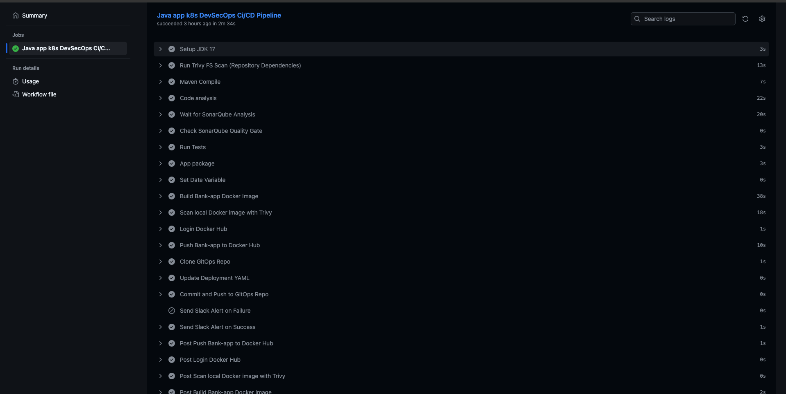

> Pipeline defined in `.github/workflows/bank-app-CI-CD-k8s.yml`, triggered on code push to `master`.
> Complete CI/CD pipeline triggered on push — includes Trivy, SonarQube, Maven build, Docker build, push, and update GitOps meanifest files with latest Image version.

---

### 2️⃣ SonarQube Code Quality Report, Dockerub and Notification
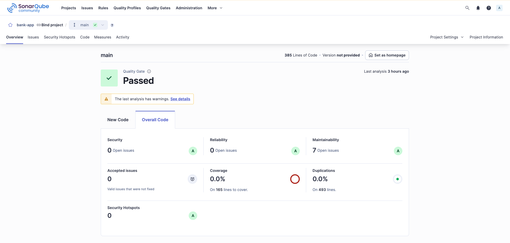

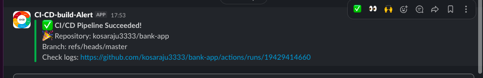
> Example of SonarQube quality gate passing successfully for Java Spring Boot code.


---

### 3️⃣ EKS Cluster
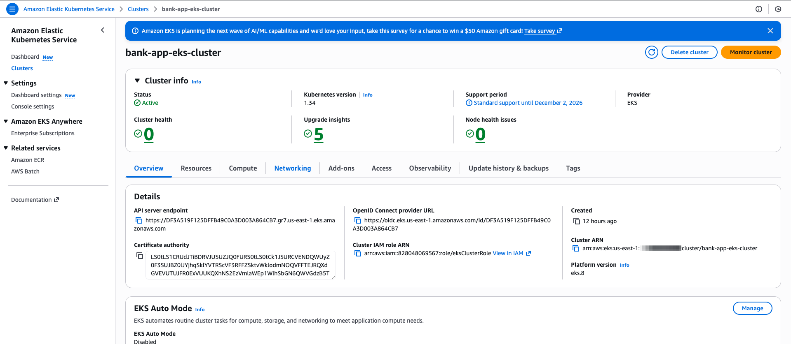
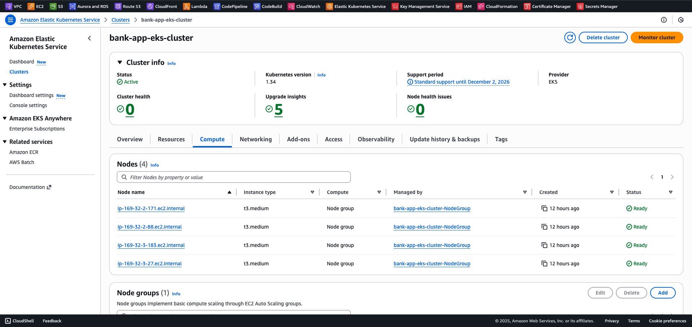

--- 

### 4️⃣ database deployemnt
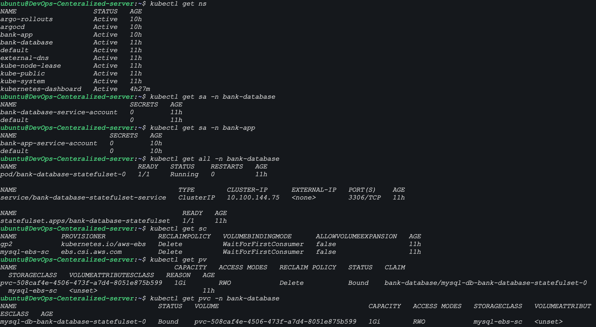
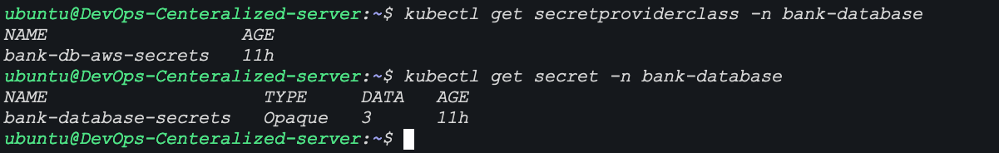


---

### 5️⃣ App deployment
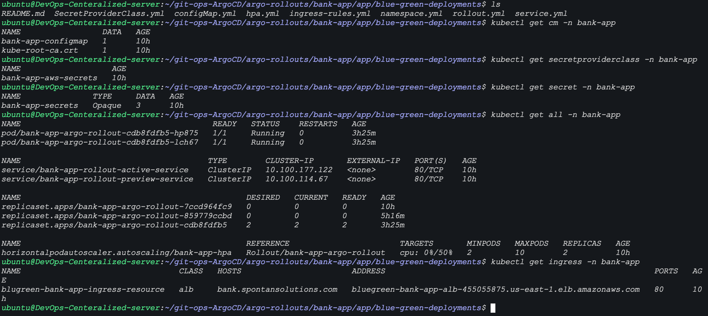
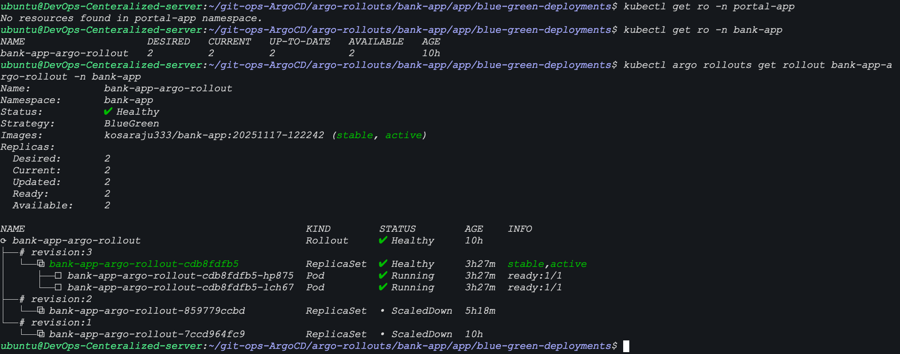

---

### 6️⃣ Exposed to external world
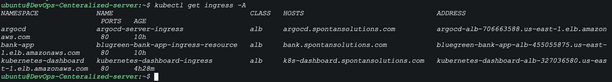
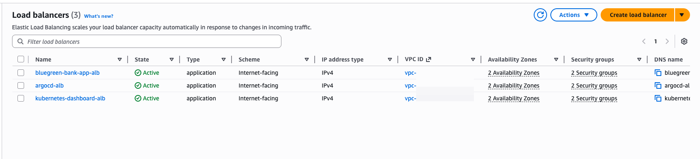

---

### 7️⃣ ArgoCD and K8s Dashboard

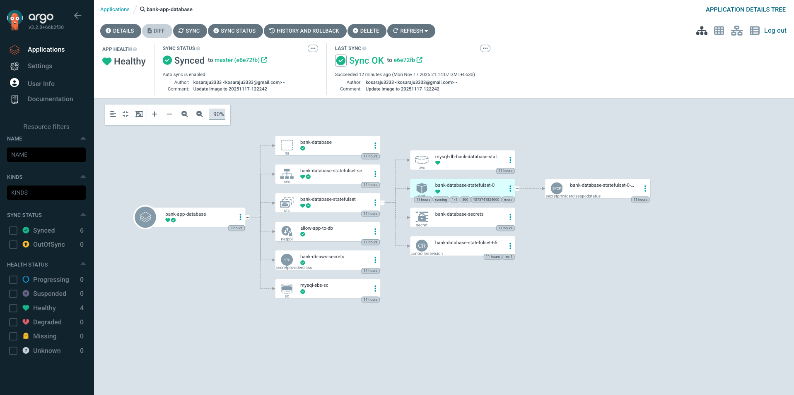
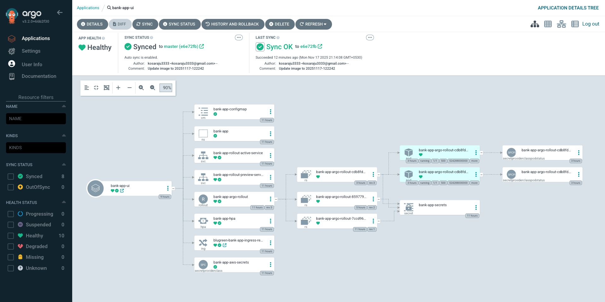
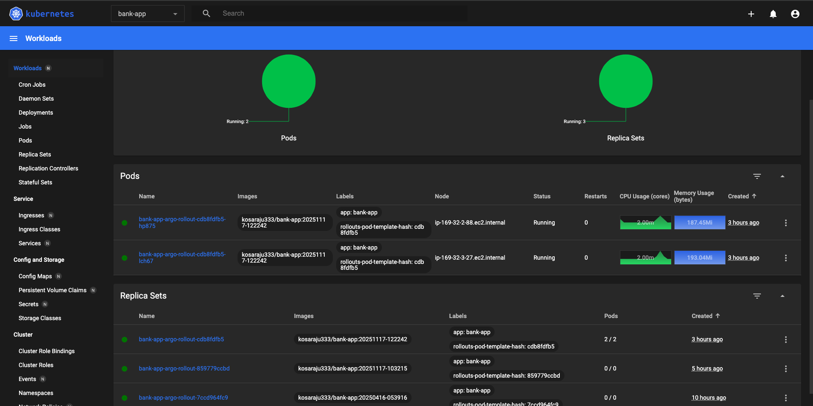


